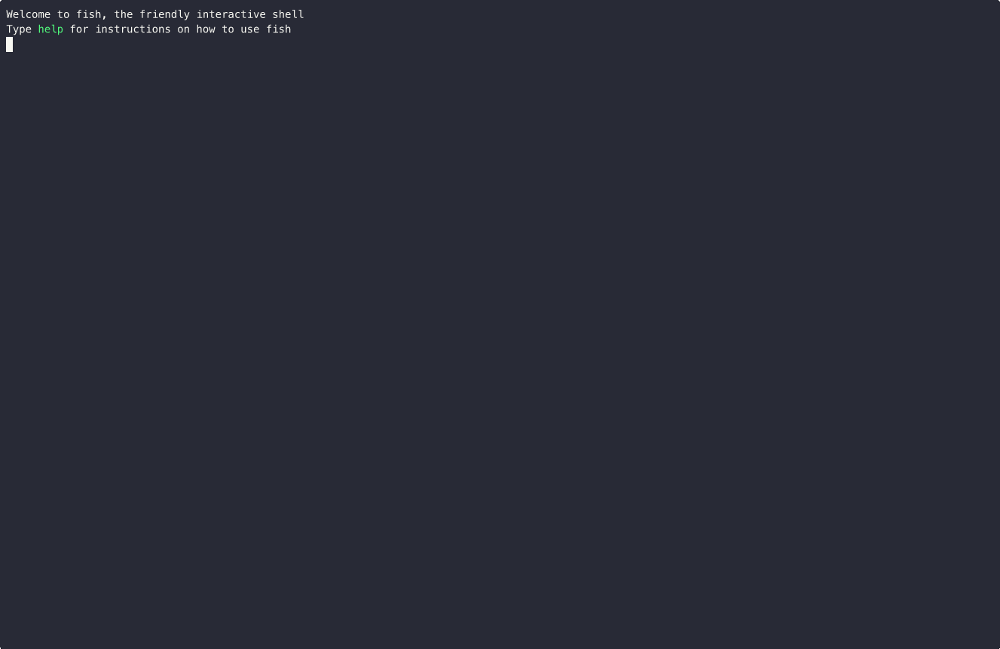

# Carbon

Carbon is a lightweight indexing framework on Solana. It provides a modular pipeline for sourcing data, decoding updates and processing them in order to build end-to-end indexers.

## Components

### Pipeline

The core of the framework. It orchestrates data flow from data sources through indexing pipes.

### Datasources

A consumable datasource that will provide updates to the pipeline. These can either be `AccountUpdate`, `TransactionUpdate` or `AccountDeletion`.

### Pipes

Process specific updates:

- **Account Pipes** handle account updates. Each contains an `AccountDecoder` and a `Processor`.
- **Account Deletion Pipes** handle account deletions. Each contains a `Processor`.
- **Instruction Pipes** handle transaction updates, instruction by instruction. Each contains an `InstructionDecoder` and a `Processor`.
- **Transaction Pipes** handle transaction updates, after schema-matching the whole transaction. Each contains a `Schema` and a `Processor`.

### Metrics

Collect and report on pipeline performance and operational data.

Our premade metrics crates assist with common use cases:

| Crate Name                  | Description                                                                   | Ease of Setup |
| --------------------------- | ----------------------------------------------------------------------------- | ------------- |
| `carbon-log-metrics`        | Logs useful program info to the terminal                                      | Easy          |
| `carbon-prometheus-metrics` | Provides a way of exporting default and custom metrics to a Prometheus server | Medium        |

## Usage

### Basic Setup

```rs
use carbon_core::pipeline::Pipeline;
use carbon_rpc_block_subscribe_datasource::{RpcBlockSubscribe, Filters};
use solana_client::{
    rpc_config::{RpcBlockSubscribeConfig, RpcBlockSubscribeFilter},
};
use crate::{
    MyAccountDecoder, MyAccountProcessor,
    MyInstructionDecoder, MyInstructionProcessor,
};

#[tokio::main]
async fn main() -> Result<(), Box<dyn std::error::Error>> {
    let pipeline = Pipeline::builder()
        .datasource(
            RpcBlockSubscribe::new(
                env::var("RPC_URL")?,
                Filters::new(RpcBlockSubscribeFilter::MentionsAccountOrProgram(env::var("MY_PROGRAM_ID")?), None)
            )
        )
        .instruction(MyInstructionDecoder::new(), MyInstructionProcessor)
        .metrics(Arc::new(LogMetrics::new()))
        .build()?;

    pipeline.run().await?;

    Ok(())
}
```

### Generating Decoders from IDL

Decoders implementations allow the pipeline to input raw account or instruction data and to receive deserialized account or instruction data. They are the backbone of indexing with Carbon.

Carbon provides a CLI tool to generate decoders based on IDL files (Anchor, Codama) or from a provided program address with a network specified to fetch an on-chain PDA IDL. This can significantly speed up the process of creating custom decoders for your Solana programs.

#### CLI Installation

You can install the Carbon CLI by downloading the pre-built binary for your operating system:

##### Linux

```sh
curl -LO https://github.com/sevenlabs-hq/carbon/releases/latest/download/carbon-cli-linux-amd64
chmod +x carbon-cli-linux-amd64
sudo mv carbon-cli-linux-amd64 /usr/local/bin/carbon-cli
```

##### macOS

```sh
curl -LO https://github.com/sevenlabs-hq/carbon/releases/latest/download/carbon-cli-macos-amd64
chmod +x carbon-cli-macos-amd64
sudo mv carbon-cli-macos-amd64 /usr/local/bin/carbon-cli
```

##### Windows

1. Download the latest release from <https://github.com/sevenlabs-hq/carbon/releases/latest/download/carbon-cli-windows-amd64.exe>
2. Rename the downloaded file to `carbon-cli.exe`
3. Move the file to a directory in your PATH

Alternatively, you can build from source using Cargo:

```sh
cargo install --git https://github.com/sevenlabs-hq/carbon.git carbon-cli
```

#### CLI Usage

```sh
carbon-cli parse [OPTIONS] --idl <IDL> --output <OUTPUT>
```

#### Options

- `-i, --idl <IDL>`: Path to an IDL json file or a Solana program address.
- `-o, --output <OUTPUT>`: Path to the desired output directory.
- `-c, --as-crate`: Generate a directory or a crate.
- `-s, --standard`: Specify the IDL standard to parse. Default: 'anchor' if not specified..
- `-e, --event-hints`: Comma-separated names of defined types to parse as CPI Events (for '--standard codama' option only).
- `-u, --url`: Network URL to fetch the IDL from. Required if input is a program address.
- `-h, --help`: Print help information.

#### Examples

##### Generate Decoder

1. To generate a decoder from an Anchor IDL file:

```sh
carbon-cli parse --idl my_program.json --output ./src/decoders
```

or with interactive mode:


This will parse the my_program.json Anchor IDL file and generate the corresponding decoder code in the ./src/decoders directory.

2. To generate a decoder from an Anchor PDA IDL, specify a program address (Meteora DLMM program in this case):

```sh
carbon-cli parse --idl LBUZKhRxPF3XUpBCjp4YzTKgLccjZhTSDM9YuVaPwxo -u mainnet-beta --output ./src/decoders
```

This will fetch Meteora DLMM program's IDL from chain and generate the corresponding decoder code in the ./src/decoders directory.

3. To generate a decoder from a Codama IDL:

```sh
carbon-cli parse --idl my_program_codama.json --output ./src/decoders --standard codama
```

This will parse the my_program_codama.json Codama IDL file and generate the corresponding decoder code in the ./src/decoders directory.

**Note**: in order to parse CPI Events for a provided Codama IDL, add `--event-hints` option with comma-separated names of corresponding defined Codama types:

```sh
carbon-cli parse --idl my_program_codama.json --output ./src/decoders --standard codama --event-hints event1,event2,event3
```

##### Scaffold Project

```sh
carbon-cli scaffold --name degen-paradize --output ./desired-folder --decoders pumpfun,moonshot,raydium-amm-v4 --data-source yellowstone-grpc
```

or with interactive mode:



### Implementing Processors

```rs
use carbon_core::account::{AccountDecoder, AccountMetadata, AccountProcessorInputType, DecodedAccount};
use crate::MyCustomAccountData;

struct MyAccountProcessor;

#[async_trait]
impl Processor for MyAccountProcessor {
    type InputType = AccountProcessorInputType<MyCustomAccountData>;

    async fn process(
        &mut self,
        input: Self::InputType,
        metrics: Arc<MetricsCollection>,
    ) -> CarbonResult<()> {
        // Implement processing logic
    }
}
```

### Implementing a Datasource

For most use cases, we recommend choosing from one of our datasource crates:

| Crate Name                     | Description                                                                                                           | Affordability               | Ease of Setup |
| ------------------------------ | --------------------------------------------------------------------------------------------------------------------- | --------------------------- | ------------- |
| `carbon-block-subscribe`       | Uses `blockSubscribe` with Solana WS JSON RPC to listen to real-time on-chain transactions                            | Cheap (just RPC)            | Easy          |
| `carbon-program-subscribe`     | Uses `programSubscribe` with Solana WS JSON RPC to listen to real-time on-chain account updates                       | Cheap (just RPC)            | Easy          |
| `carbon-transaction-crawler`   | Crawls historical successful transactions for a specific address in reverse chronological order using Solana JSON RPC | Cheap (just RPC)            | Easy          |
| `carbon-jito-shredstream-grpc` | Listen to JITO's shredstream                                                                                          | Medium (Shredstream proxy)  | Medium        |
| `carbon-helius-atlas-ws`       | Utilizes Helius Geyser-enhanced WebSocket for streaming account and transaction updates                               | Medium (Helius Plan)        | Medium        |
| `carbon-yellowstone-grpc`      | Subscribes to a Yellowstone gRPC Geyser plugin enhanced full node to stream account and transaction updates           | Expensive (Geyser Fullnode) | Complex       |

You can still implement custom datasources in the following manner:

```rs
use carbon_core::datasource::{Datasource, Update, UpdateType};

struct MyDataSource;

#[async_trait]
impl Datasource for MyDataSource {
    async fn consume(
        &self,
        sender: &tokio::sync::mpsc::UnboundedSender<Update>,
        cancellation_token: CancellationToken,
    ) -> CarbonResult<()> {
        // Implement data fetching and sending logic
    }

    fn update_types(&self) -> Vec<UpdateType> {
        vec![UpdateType::AccountUpdate, UpdateType::Transaction]
    }
}
```

### Available Program Decoders

Decoders for most popular Solana programs are published and maintained:

| Crate Name                                 | Description                               | Program ID                                   |
| ------------------------------------------ | ----------------------------------------- | -------------------------------------------- |
| `carbon-address-lookup-table-decoder`      | Address Lookup Table Decoder              | AddressLookupTab1e1111111111111111111111111  |
| `carbon-associated-token-account-decoder`  | Associated Token Account Decoder          | ATokenGPvbdGVxr1b2hvZbsiqW5xWH25efTNsLJA8knL |
| `carbon-boop-decoder`                      | Boop Decoder                              | boop8hVGQGqehUK2iVEMEnMrL5RbjywRzHKBmBE7ry4  |
| `carbon-drift-v2-decoder`                  | Drift V2 Program Decoder                  | dRiftyHA39MWEi3m9aunc5MzRF1JYuBsbn6VPcn33UH  |
| `carbon-fluxbeam-decoder`                  | Fluxbeam Program Decoder                  | FLUXubRmkEi2q6K3Y9kBPg9248ggaZVsoSFhtJHSrm1X |
| `carbon-gavel-decoder`                     | Gavel Pool Decoder                        | srAMMzfVHVAtgSJc8iH6CfKzuWuUTzLHVCE81QU1rgi  |
| `carbon-jupiter-dca-decoder`               | Jupiter DCA Program Decoder               | DCA265Vj8a9CEuX1eb1LWRnDT7uK6q1xMipnNyatn23M |
| `carbon-jupiter-limit-order-decoder`       | Jupiter Limit Order Program Decoder       | jupoNjAxXgZ4rjzxzPMP4oxduvQsQtZzyknqvzYNrNu  |
| `carbon-jupiter-limit-order-2-decoder`     | Jupiter Limit Order 2 Program Decoder     | j1o2qRpjcyUwEvwtcfhEQefh773ZgjxcVRry7LDqg5X  |
| `carbon-jupiter-perpetuals-decoder`        | Jupiter Perpetuals Program Decoder        | PERPHjGBqRHArX4DySjwM6UJHiR3sWAatqfdBS2qQJu  |
| `carbon-jupiter-swap-decoder`              | Jupiter Swap Program Decoder              | JUP6LkbZbjS1jKKwapdHNy74zcZ3tLUZoi5QNyVTaV4  |
| `carbon-kamino-farms-decoder`              | Kamino Farms Program Decoder              | FarmsPZpWu9i7Kky8tPN37rs2TpmMrAZrC7S7vJa91Hr |
| `carbon-kamino-lending-decoder`            | Kamino Lend Decoder                       | KLend2g3cP87fffoy8q1mQqGKjrxjC8boSyAYavgmjD  |
| `carbon-kamino-limit-order-decoder`        | Kamino Limit Order Program Decoder        | LiMoM9rMhrdYrfzUCxQppvxCSG1FcrUK9G8uLq4A1GF  |
| `carbon-kamino-vault-decoder`              | Kamino Vault Decoder                      | kvauTFR8qm1dhniz6pYuBZkuene3Hfrs1VQhVRgCNrr  |
| `carbon-lifinity-amm-v2-decoder`           | Lifinity AMM V2 Program Decoder           | 2wT8Yq49kHgDzXuPxZSaeLaH1qbmGXtEyPy64bL7aD3c |
| `carbon-marginfi-v2-decoder`               | Marginfi V2 Program Decoder               | MFv2hWf31Z9kbCa1snEPYctwafyhdvnV7FZnsebVacA  |
| `carbon-marinade-finance-decoder`          | Marinade Finance Program Decoder          | MarBmsSgKXdrN1egZf5sqe1TMai9K1rChYNDJgjq7aD  |
| `carbon-memo-program-decoder`              | SPL Memo Program Decoder                  | Memo1UhkJRfHyvLMcVucJwxXeuD728EqVDDwQDxFMNo  |
| `carbon-meteora-damm-v2-decoder`           | Meteora DAMM V2 Program Decoder           | cpamdpZCGKUy5JxQXB4dcpGPiikHawvSWAd6mEn1sGG  |
| `carbon-meteora-dlmm-decoder`              | Meteora DLMM Program Decoder              | LBUZKhRxPF3XUpBCjp4YzTKgLccjZhTSDM9YuVaPwxo  |
| `carbon-meteora-pools-decoder`             | Meteora Pools Program Decoder             | Eo7WjKq67rjJQSZxS6z3YkapzY3eMj6Xy8X5EQVn5UaB |
| `carbon-moonshot-decoder`                  | Moonshot Program Decoder                  | MoonCVVNZFSYkqNXP6bxHLPL6QQJiMagDL3qcqUQTrG  |
| `carbon-mpl-core-decoder`                  | MPL Core Program Decoder                  | CoREENxT6tW1HoK8ypY1SxRMZTcVPm7R94rH4PZNhX7d |
| `carbon-mpl-token-metadata-decoder`        | MPL Token Metadata Program Decoder        | metaqbxxUerdq28cj1RbAWkYQm3ybzjb6a8bt518x1s  |
| `carbon-name-service-decoder`              | SPL Name Service Program Decoder          | namesLPneVptA9Z5rqUDD9tMTWEJwofgaYwp8cawRkX  |
| `carbon-okx-dex-decoder`                   | OKX DEX Decoder                           | 6m2CDdhRgxpH4WjvdzxAYbGxwdGUz5MziiL5jek2kBma |
| `carbon-openbook-v2-decoder`               | Openbook V2 Program Decoder               | opnb2LAfJYbRMAHHvqjCwQxanZn7ReEHp1k81EohpZb  |
| `carbon-orca-whirlpool-decoder`            | Orca Whirlpool Program Decoder            | whirLbMiicVdio4qvUfM5KAg6Ct8VwpYzGff3uctyCc  |
| `carbon-phoenix-v1-decoder`                | Phoenix V1 Program Decoder                | PhoeNiXZ8ByJGLkxNfZRnkUfjvmuYqLR89jjFHGqdXY  |
| `carbon-pumpfun-decoder`                   | Pumpfun Program Decoder                   | 6EF8rrecthR5Dkzon8Nwu78hRvfCKubJ14M5uBEwF6P  |
| `carbon-pump-swap-decoder`                 | PumpSwap Program Decoder                  | pAMMBay6oceH9fJKBRHGP5D4bD4sWpmSwMn52FMfXEA  |
| `carbon-raydium-amm-v4-decoder`            | Raydium AMM V4 Program Decoder            | 675kPX9MHTjS2zt1qfr1NYHuzeLXfQM9H24wFSUt1Mp8 |
| `carbon-raydium-clmm-decoder`              | Raydium CLMM Program Decoder              | CAMMCzo5YL8w4VFF8KVHrK22GGUsp5VTaW7grrKgrWqK |
| `carbon-raydium-cpmm-decoder`              | Raydium CPMM Program Decoder              | CPMMoo8L3F4NbTegBCKVNunggL7H1ZpdTHKxQB5qKP1C |
| `carbon-raydium-launchpad-decoder`         | Raydium Launchpad Program Decoder         | LanMV9sAd7wArD4vJFi2qDdfnVhFxYSUg6eADduJ3uj  |
| `carbon-raydium-liquidity-locking-decoder` | Raydium Liquidity Locking Program Decoder | LockrWmn6K5twhz3y9w1dQERbmgSaRkfnTeTKbpofwE  |
| `carbon-raydium-stable-swap-decoder`       | Raydium Stable Swap Program Decoder       | 5quBtoiQqxF9Jv6KYKctB59NT3gtJD2Y65kdnB1Uev3h |
| `carbon-sharky-decoder`                    | SharkyFi Decoder                          | SHARKobtfF1bHhxD2eqftjHBdVSCbKo9JtgK71FhELP  |
| `carbon-solayer-pool-restaking-decoder`    | Solayer Pool Restaking Program Decoder    | sSo1iU21jBrU9VaJ8PJib1MtorefUV4fzC9GURa2KNn  |
| `carbon-stabble-stable-swap-decoder`       | Stabble Stable Swap Decoder               | swapNyd8XiQwJ6ianp9snpu4brUqFxadzvHebnAXjJZ  |
| `carbon-stabble-weighted-swap-decoder`     | Stabble Weighted Swap Decoder             | swapFpHZwjELNnjvThjajtiVmkz3yPQEHjLtka2fwHW  |
| `carbon-stake-program-decoder`             | Stake Program Decoder                     | Stake11111111111111111111111111111111111111  |
| `carbon-system-program-decoder`            | System Program Decoder                    | 11111111111111111111111111111111             |
| `carbon-token-2022-decoder`                | Token 2022 Program Decoder                | TokenzQdBNbLqP5VEhdkAS6EPFLC1PHnBqCXEpPxuEb  |
| `carbon-token-program-decoder`             | Token Program Decoder                     | TokenkegQfeZyiNwAJbNbGKPFXCWuBvf9Ss623VQ5DA  |
| `carbon-virtual-curve-decoder`             | Meteora Virtual Curve Program Decoder     | dbcij3LWUppWqq96dh6gJWwBifmcGfLSB5D4DuSMaqN  |
| `carbon-virtuals-decoder`                  | Virtuals Program Decoder                  | 5U3EU2ubXtK84QcRjWVmYt9RaDyA8gKxdUrPFXmZyaki |
| `carbon-zeta-decoder`                      | Zeta Program Decoder                      | ZETAxsqBRek56DhiGXrn75yj2NHU3aYUnxvHXpkf3aD  |

## Pre-commit hooks

To activate the pre-commit hook, run `./.pre-commit.sh` once.
This will cause the following rules to be registered and called at the next `git commit`.

The following checks will be performed:

- fmt: Checks code formatting using `cargo fmt --check`.
- clippy: Runs `clippy` on the codebase to catch potential issues.
- cargo_sort: Utilizes `cargo-sort` to ensure Cargo.toml files are sorted correctly.
- machete: Checks for unused Cargo dependencies using `cargo-machete`.

## Test

```sh
cargo test
```

## License

We are under the [MIT license](https://github.com/sevenlabs-hq/carbon/tree/main/LICENSE.md).
